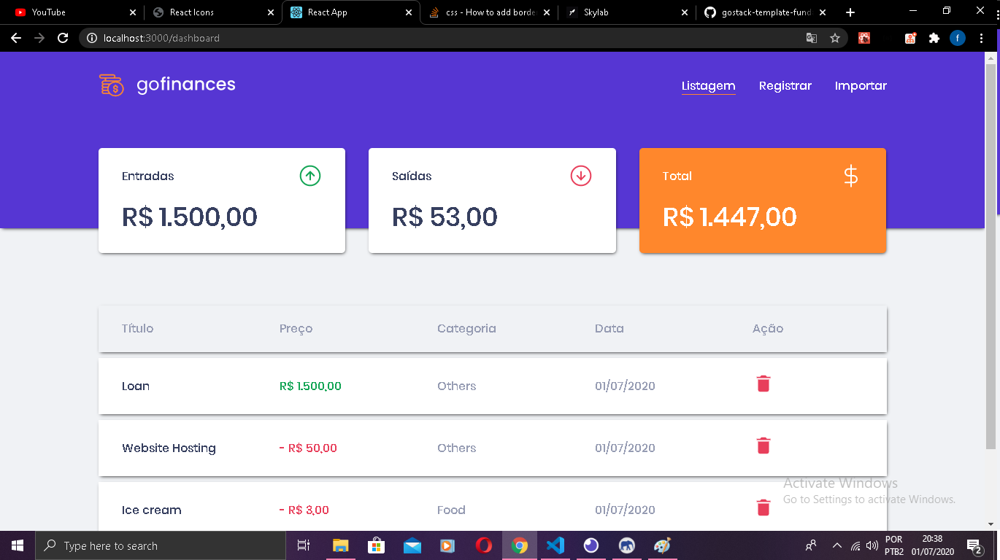
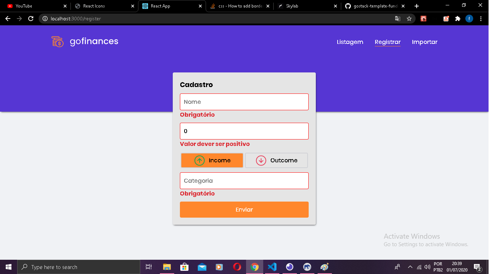
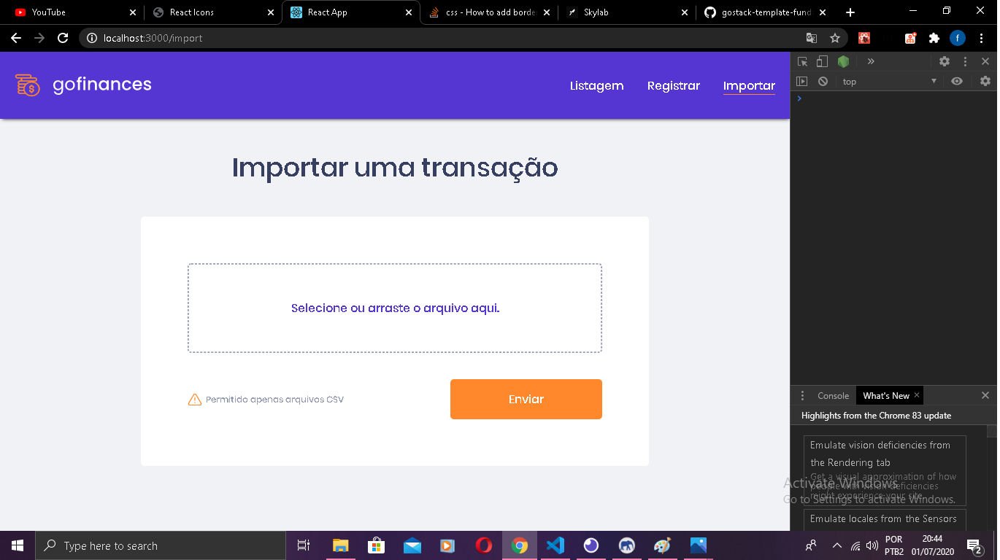
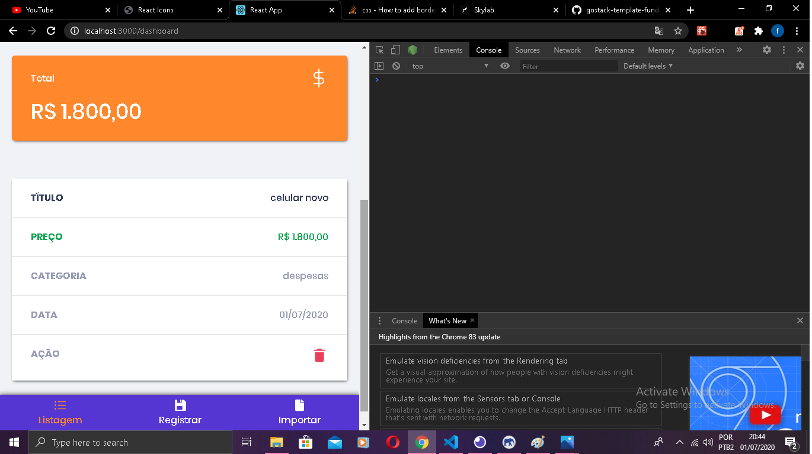

# goBalance

Para utilizar completamente este projeto você precisa deste repositório e deste https://github.com/Matheus-SS/DatabaseUploadTypescript, porque o segundo repositório é o back-end da aplicação.

Este projeto foi um desafio proposto pelo bootcamp da rocketseat onde deveríamos utilizar a api que construímos em outro desafio https://github.com/Matheus-SS/DatabaseUploadTypescript,

O layout e a base o projeto já estava pronto, o que deveríamos fazer era que: listassem a transações feitas, e importar o CSV.

O que foi feito em adicinal e que não estava proposto no desafio foram:

- versão responsiva
- criar uma página para registrar as transações
- utilizar o formik junto com o yup para validação dos formulários
- utilizar react-toastify para animações

